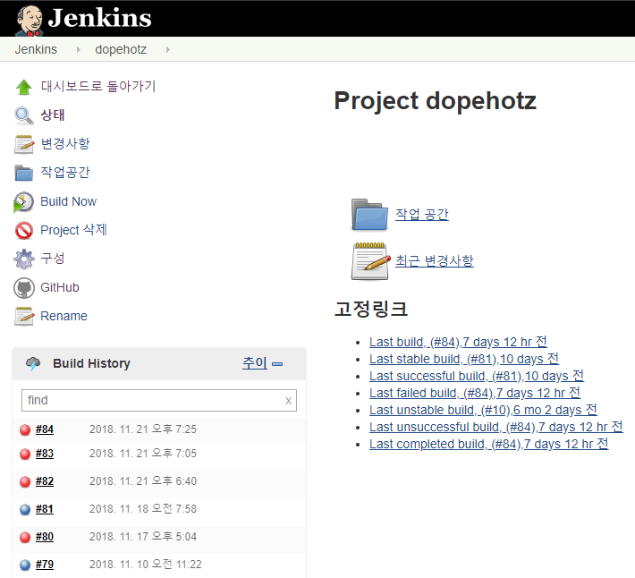
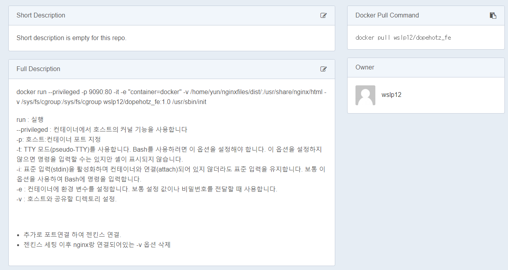
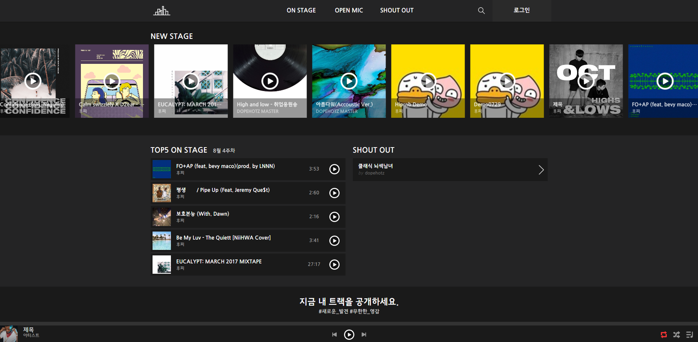
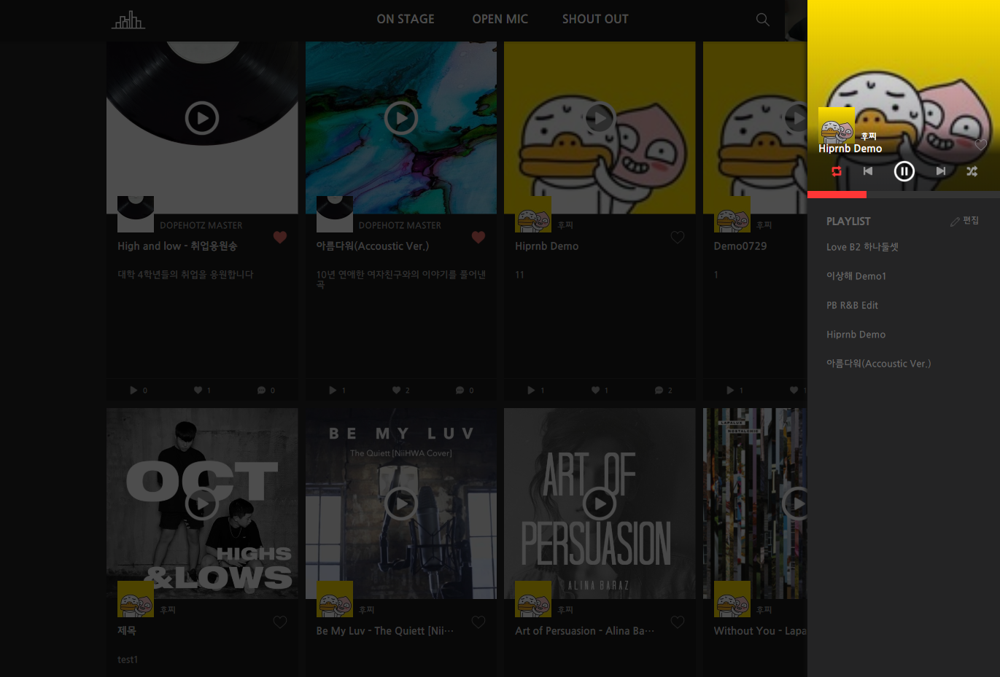
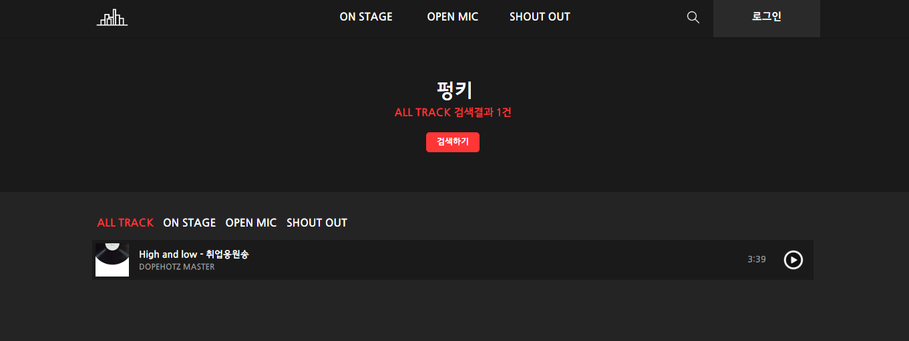
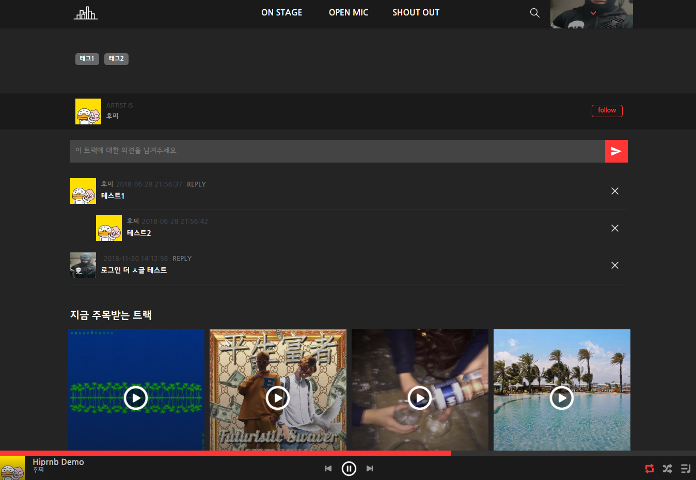

https://dopehotz.com/

## 서버 실행  
1. `npm intall` : package.json 모듈 다운로드
2. `ng server` : 서버 실행  

> `--port` : 포트 변경  ( `ng serve` default 4200 )  
> `--host` : 0.0.0.0 ( `ng serve` default 127.0.0.1 )

#### Internet Information Services를 이용한 실행방법
1. 제어판  
2. Window 기능 켜기/끄기
3. 인터넷 정보 서비스 체크
> 사이트의 실제경로에는 `ng build` 이후 dist 폴더안의 프로젝트 경로를 넣어준다.

### 빌드
`ng build` : javascript 코드로 변환시키는 컴파일 과정을 거친다. component의 오류를 감지한다.  
> `--prod` : production 환경으로 실행

### 기타 명령어.
`ng generate component component-name` : 컴포넌트 생성  
`ng --version` : 앵귤러 버전확인

## 사용된 기술
#### jenkins (raspberry pi)
gitlab에서 이벤트를 감지 이후 빌드 
빌드 완료 후 SFTP 프로토콜 접속 및 배포
  
~~jenkins~~
>~~http://jhonbur.com:8090/job/dopehotz/~~
#### docker
프로젝트 진행중 잦은 서버 옮김 및 문제로 인해 docker 도입  
  

~~자세한 docker 명령어 및 실행방법 dockerhub를 참조~~  
>~~https://hub.docker.com/r/wslp12/dopehotz_fe/~~

## --------------------------------------
  
  
  
  
